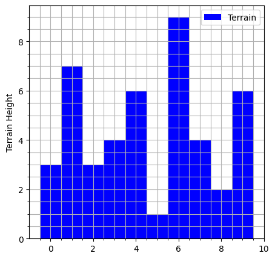
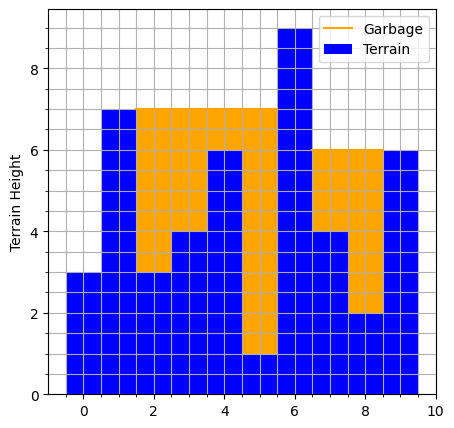

# PS3: Quary Quantifier 
### Deadline: May 14 at 23:00
## Introduction

Oh no! All the garbage of the world is disrupting the food chain. Luckily, one genius scientist has the extremely original idea of using old, unoperational quaries as dumping sites. But NATO and WHO aren't convinced that this is a good idea. They want silly statistics, a quantity that tells them how much garbage can really fit into all these quaries.

The scientist collects data about the terrain of all the quaries they can find in the form of polygon height-maps. For example, one quary can be represented like this:
```
[3,7,3,4,6,1,9,4,2,6]
```
which looks like this:


Unfortunately, the scientist did not take COMP100 and does not know how to computerize the calculation of how much gargbage can fit into a quary like the one described above. Your job is to implement a recursive function, `quantify_quary()` that takes the height-map of one quary, and outputs the total quantity, in units^2, that the quary can hold. Assume that garbage behaves like a fluid, i.e. it flattens at the top and fills up any cavities completely:


The total garbage that this quary can hold is 20

* Implement your solution in `main.py`, `quantify_quary(terrain_data)`
* Assume the x-values in terrain data will always be 1 unit apart, starting from 0
* You can implement as many helper functions as you want
* No loops or list comprehensions are allowed, any code that has any mention of `for ` or `while ` will cost you 40 points. So double check to make sure even your comments don't have the words *for* or *while*
* Make sure your code has no syntax or indentation errors
* There will be additional auto-test cases after the submission deadline

Hints:
* Start by computing what is the garbage level at each data point, i.e. the max y location at which garbage can exist on top of it, if there are taller terrain on either side of it. This garbage level can be computed by computing the minimum of the maximum of all terrain to the left and right of the data point. For example, at x=2, the max y value of the terrain to the left is `max([3,7]) = 7`, and the max y value to the right is `max([4,6,1,9,4,2,6]) = 9`. So the garbage level at x=2 will be `min(7,9) = 7`
* Then, you compute the amount of garbage at that data point by taking the differene between the garbage level and terrain at x=2 i.e.: `garbage_level - data_point = 7 - 3 = 4` So now you know how much garbage can exist on top of the terrain at x=2.
* You should repeat this for all data points in the terrain and return the sum.
* be careful: garbage can only exist if there is a bank on both sides of a data point that is taller than it. For example, at x=0, garbage cannot exist because there is no bank to the left of it
* If you have difficuly implementing a recursive solution, implement it using for loops first. Then simplify it and organize your code with helper functions. Then convert everything to a recursive equivalent. Your final submission should not have any for/while loops

